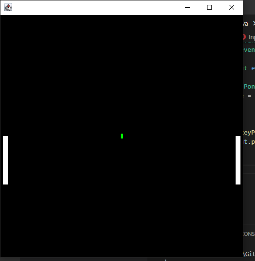

# pong
building pong. at last. the essence of 2d games. am i worthy?

## latest progress

so i have built pong. from scratch, off the top of my head. yesss. why was this such a big deal for me? well,
i see pong as the simplest expression of what a 2d game is. it has all the pieces of any more complex game, 
animation, multiple objects, collision detection, etc. if i add a computer player, then there'll be game ai.

i'll admit, there's a lot more to pong than meets the eye. i ended up giving the ball random y trajectories 
after colliding with the paddles. i read somewhere that the original game divided the paddle into sections 
and set the y trajectory based on where the ball made contact. i'd like to implement that at somepoint 
perhaps, but for now i'm excited to have the basic mechanics done. 

it'd be cool to add powerups or even random obstacles. that would almost require the addition of the 
intentional trajectories though because you'd need to be able to place the ball precisely in that case in 
order for it to be fair. so i need to figuire that part out.

wow. this is coool.

this is like my capstone for n00bness 101 or something. i see pong as the most fundamental expression of a 2d game. this is my first time really attempting to implement it 
completely from my head, no tutorials, no videos, just feeling it out, using my code instincts. if i can build a complete implementation, suffice it to say, it will be a 
big deal to me personally. 

so far ive just built the window and defined the game objects: the paddles and the ball. ive added an input class to handle key presses. next will be to begin to work out 
the movement of the ball and its interactions with the edges.
