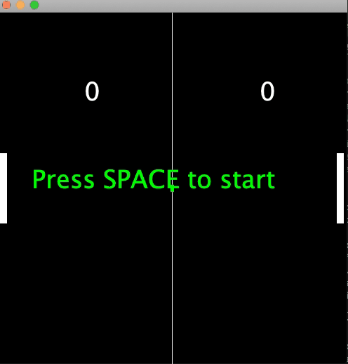

# pong
building pong. at last. the essence of 2d games. am i worthy?

## latest progress

## predictible vollies

so i divided the paddles into 4 segments with the upper sending the ball upward, the middle two stright across and the lower downward. this makes the game a bit more of a 
game of skill, since a player may now strategize against an opponent: say your opponent is near the bottom and returns the ball to you near the top edge, you could align 
your paddle to send the ball straight across, forcing the opponent to race upward. 

implementing this feature was important to me to make the game more complete. interestingly, it now begs another feature, varying speed. the game is just the slightest bit 
easy now as the vollies are predictible since you can see where on the opposite paddle the ball makes contact and therefore exactly where the ball will go. im thinking of 
adding the feature of the ball increasing in speed by a fixed amount with each turn, then randomly starting back at base velocity of the ball remains in play for a certain 
number of turns. this will enhance gameplay quite a bit.

i can see how this could likely go on forever. :smile:

## double buffering implemented

i hate that im unable to create a gif with high enough definition to display it, but double buffering has made the graphics super smooth. this was the first time i really 
fully understood the conceptof double buffering. i went to one of my _vintage_ game dev books, _The Black Art of Java Game Programming_, published in 1996 to make sure i 
was going about it properly. the explanation there made the concept clear: the flickering that happens when rendering the former, direct way is caused by the call to the 
clearRect() method that clears the screen before rendering the next frame. all double buffering does is eliminate that step by leaving the former frame displayed and simply 
dumping the new frame to the screen over the top of it, so the display is never blank and you dont see the contents get drawn. i knew this already, but had never completely 
understood it quite so succintly. i always felt the culprit was dropped frames, not the clearing of the screen. it makes perfect sense now.

so now i have nowhere to run anymore, i have to implement the intentional ball trajectories based on the area of the paddle contacted. :fearful:

## message screens, win state, reset

added a start screen and the win state which is triggered when a player reaches 10 points. this wraps the major features. it's now a fully playable game. you can restart 
at any point by pressing 'r'.

anything further i do after this will be gameplay enhancements. i still intend to make the ball trajectory predictable based on the contact point. that will be the finishing 
touch for me here.

im really happy to have finally built something more or less complete. building pong from scratch has been a goal for a long time. this is big.

i wonder if i could add power ups? how far could this go?

this would also be a great chance to practice implementing double buffering...

## set framerate/update rate

I fixed a couple bugs, like the paddles going past the screen at times. this was happening because i had broken the separation of concerns of the different modules: i
was making changes to game model data in the input module. events happen on a separate thread in java and so were taking place despite the update method which is actually 
the place where the game world progresses. it took a while to figure that out, but im happy with the result. 

i set the framerate to 30 fps. itoyed around with moving rendering into a separate thread before realizing i could do the same thing right in main. ill eventually do a 
proper game loop, but this is fine for now, though it could stand some backbuffering to stop the flickering.

i also added pause and quit with p and q respectively. next i need to add win states and restarting.

pleased.

so i have built pong. from scratch, off the top of my head. yesss. why was this such a big deal for me? well,
i see pong as the simplest expression of what a 2d game is. it has all the pieces of any more complex game, 
animation, multiple objects, collision detection, etc. if i add a computer player, then there'll be game ai.

i'll admit, there's a lot more to pong than meets the eye. i ended up giving the ball random y trajectories 
after colliding with the paddles. i read somewhere that the original game divided the paddle into sections 
and set the y trajectory based on where the ball made contact. i'd like to implement that at somepoint 
perhaps, but for now i'm excited to have the basic mechanics done. 

it'd be cool to add powerups or even random obstacles. that would almost require the addition of the 
intentional trajectories though because you'd need to be able to place the ball precisely in that case in 
order for it to be fair. so i need to figuire that part out.

wow. this is coool.

this is like my capstone for n00bness 101 or something. i see pong as the most fundamental expression of a 2d game. this is my first time really attempting to implement it 
completely from my head, no tutorials, no videos, just feeling it out, using my code instincts. if i can build a complete implementation, suffice it to say, it will be a 
big deal to me personally. 

so far ive just built the window and defined the game objects: the paddles and the ball. ive added an input class to handle key presses. next will be to begin to work out 
the movement of the ball and its interactions with the edges.
